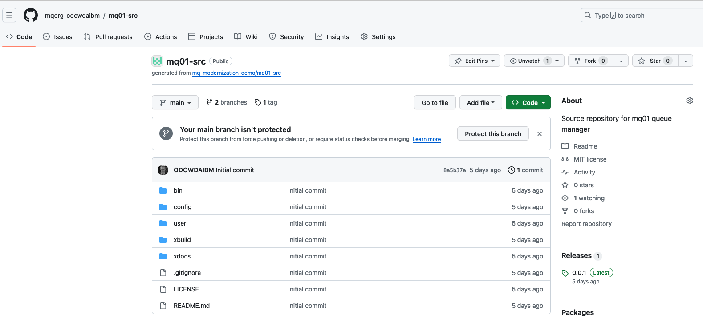

## Overview

This tutorial demonstrates a platform engineering approach to IBM MQ
development and deployment. It demonstrates continuous integration, continuous
deployment, GitOps, Infrastructure as Code and DevOps using containers,
Kubernetes and a set of popular cloud native tools such as ArgoCD and Tekton.

In this tutorial, you will:

1. Create a Kubernetes cluster and image registry, if required.
2. Create an operational repository to store MQ resources that are
   deployed to the Kubernetes cluster.
3. Install ArgoCD to manage the continuous deployment of MQ-related
   resources to the cluster.
4. Create a source Git repository that holds the MQ development artifacts
   for a queue manager.
5. Install Tekton to provide continuous integration of the source MQ
   artifacts. These pipeline ensures that all changes to these artifacts are
   successful built, packaged, versioned and tested before they are delivered
   into the operational repository, read for deployment.
6. Gain experience with the IBM-supplied MQ operator and container.

By the end of the tutorial, you will have practical experience and knowledge of
platform engineering with MQ in a Kubernetes environment.

---

## Introduction

The following diagram shows a CICD pipeline for MQ:


Notice:

- The git repository `mq01-src` holds the source development artifacts for a
  queue manager `mq01`.
- A Tekton pipeline uses the `mq01-src` repository to build, package, test,
  version and deliver resources that define the `mq01` MQ appliance.
- If the pipeline is successful, then the YAMLs that define `mq01` are stored in
  the operational repository `mq01-ops` and the container image for `mq01` is
  stored in an image registry.
- Shortly after the changes are committed to the git repository, an ArgoCD
  application detects the updated YAMLs. It applies them to the cluster to create or
  update a running `mq01` queue manager.


This tutorial will walk you through the process of setting up this configuration:
- Step 1: Follow [these instructions this
  repository](https://github.com/mq-modernization-demo/mq01-ops#readme) to set up your
  cluster, ArgoCD and the `mq01-ops` repository. When complete, you will return
  to this repository to complete step 2.
- Step 2: Continue with the instructions in this README to create the `mq01-src`
  repository, run a tekton pipeline to populate the `mq01-ops` repository and
  interact with the new or updated queue manager`mq01`.

---

## Restarting the tutorial

If you're doing this tutorial over an extended period, it may result in you
using a different terminal session. Don't forget to:

* Re-define key environment variables:

  ```bash
  export GITUSER=<GitHub user name>
  export GITORG=mqorg-$GITUSER
  export GITTOKEN=<PAT copied from GitHub>
  ```

* Login to Kubernetes cluster

  ```bash
  oc login --token=sha256~noTAVal1dSHA --server=https://example.cloud.com:31428
  ```

  by selecting `Copy login command` from the OpenShift web console.

---

## Creating the `mq01-src` repository

We use a [template
repository](https://github.com/mq-modernization-demo/mq01-src) to create a copy
of `mq01-src` in our organization. Using a template repository results in our
instance of `mq01-src` having a clean git history. It means that we can track
the history of changes to our queue manager `mq01`.

<br> Click on [this URL](https://github.com/mq-modernization-demo/mq01-src/generate) to fork
from the `mq01-src` template repository:


This screen allows you to define the properties for you copy of the `mq01-src`
repository.

Specifically:

* In the `Owner` dropdown, select your recently created organization, e.g. `mqorg-xxxxx`
* In the `Repository name` field, specify `mq01-src`.
* In the `Description` field, specify `Source repository for mq01 queue manager`.
* Select `Public` for the repository visibility.
* Select `Include all branches`.

<br> Click on `Create repository from template`:

<br> This repository will be cloned to the specified GitHub account:


<br> You have successfully created a copy of the `mq01-src` repository in your
organization.

---

## Clone repository to your local machine

We're going to use the contents of the `mq01-src` repository to build the `mq01`
queue manager. First we need to clone this repository to our local machine.

In the terminal window, issue the following command:

```bash
cd $HOME/git/$GITORG-tutorial
git clone https://$GITTOKEN@github.com/$GITORG/mq01-src.git
cd mq01-src
```

which will clone the repository to your local machine.

```bash
Cloning into 'mq01-src'...
remote: Enumerating objects: 69, done.
remote: Counting objects: 100% (69/69), done.
remote: Compressing objects: 100% (58/58), done.
remote: Total 69 (delta 4), reused 52 (delta 2), pack-reused 0
Receiving objects: 100% (69/69), 390.75 KiB | 1.01 MiB/s, done.
Resolving deltas: 100% (4/4), done.
```

---

## The `mq01-src` repository

The structure of the `mq01-src` repository reflects the structure of the `mq01`
queue manager running in the cluster. Specifically, when built, this repository
will result in the creation of a container running the `mq01` queue manager in a
Kubernetes pod, together with other associated Kubernetes artifacts, such as the
secret that holds the Queue managers X.509 certificate.

Let's explore the repository to see this structure.

```bash
tree -L 1
```

```bash
.
├── LICENSE
├── README.md
├── bin
├── config
├── user
├── xbuild
└── xdocs
```

Notice the simplicity of this structure:
* a `LICENSE` file
* a `README.md` containing this tutorial, and its associated documentation and diagrams in the `xdocs` folder
* a `bin` folder
* a `config` folder
* a `user` folder
* a `xbuild` folder

Issue the following command:

```bash
tree bin config user
```

which will show the structure of the three most important folders:

```bash
bin
└── Dockerfile
config
├── mqs.ini
├── qm.ini
├── scripts
│   ├── kustomization.yaml
│   ├── start-mqsc.sh
│   └── stop-mqsc.sh
└── yamls
    ├── kustomization.yaml
    ├── mq01-cert.yaml
    └── mq01-qmgr.yaml
user
└── mqsc
    └── mq01.mqsc
```

Note:
* The `bin` folder contains the exact version MQ image being used by `mq01` via the `Dockerfile`
* The `config` folder contains the configuration of the queue manager for example, `qm.ini` and `mqs.ini` configuration files.
* The `user` folder contains the definitions in support of MQ applications connected to this queue manager, including MQ channel definitions.

Of course, other repository mappings are possible -- for example a repository
could define a queue manager cluster rather than a single queue manager.
However, the above structure is a great starting point for your learning and any
experimentation you might want to do in the future.

---

## MQ build pipeline

To build, test, version and create the image for the `mq01` queue manager, we're
going to use a set of Tekton tasks combined into a Tekton pipeline. Each task
will perform a specific function such as building the queue manager container
image, or testing it. Let's have a quick look at the Tekton artifacts:

Issue the following command:

```bash
cd $HOME/git/$GITORG-tutorial/mq01-src/xbuild/pipelines/dev-build
tree
```

which will show the Tekton YAMLs:

```bash
.
├── mq-build-image.yaml
├── mq-clone.yaml
├── mq-dev-pipeline.yaml
├── mq-dev-pipelinerun.yaml
├── mq-gen-yamls.yaml
├── mq-push.yaml
├── mq-store-yamls.yaml
├── mq-tag.yaml
└── mq-test.yaml
```

You can examine these YAMLs to see how they work; here's a brief outline:

* `mq-dev-pipeline.yaml` defines a Tekton pipeline comprising the following tasks:
  * `mq-clone.yaml` defines a Tekton task to clone the `mq01-src` queue manager source repository.
  * `mq-tag.yaml` creates a version for this change based on the git tag, that can be used by other tasks.
  * `mq-build-image.yaml` builds a versioned image using the cloned repository and stores in the image registry.
  * `mq-gen-yamls.yaml` generates the Kubernetes YAMLs for the queue manager, including secrets and config maps.
  * `mq-test.yaml` tests the queue manager.
  * `mq-store-yamls.yaml` stores the YAMLs used to test the queue manager.
  * `mq-push.yaml` pushes the YAMLs to the `mq01-ops` repository, ready for deployment by ArgoCD.
* `mq-dev-pipelinerun.yaml` runs the pipeline to build the queue manager.

We'll now install and run this Tekton pipeline.

---

## Create cluster pipeline resources

```bash
oc apply -f mq-clone.yaml
oc apply -f mq-gen-yamls.yaml
oc apply -f mq-push.yaml
oc apply -f mq-dev-pipeline.yaml
oc apply -f mq-store-yamls.yaml
oc apply -f mq-build-image.yaml
oc apply -f mq-test.yaml
oc apply -f mq-tag.yaml
```

---

## Customize pipeline

> **Note**<br>
>
> Fix this

```bash
envsubst <mq-dev-pipelinerun.yaml > mq-dev-pipelinerun.yaml
```


## Run pipeline

```bash
oc create -f mq-dev-pipelinerun.yaml
```

In the following command replace `xxxxx` with the new pipeline run identifier:

```bash
tkn pipelinerun logs ,mq-dev-pipeline-run-xxxxx -n mq01-dev -f
```

## View pipelinerun in the web console

Show progress in `tkn` command line tool?

---

## Interact with Queue manager

We can connect to the queue manager using the MQ web console. The MQ operator
has created two routes for the queue manager:

* a route for applications and channels to connect to the queue manager
* a route for users to connect to the web console

Issue the following command:

```bash
oc get route -n mq01-dev
```

which shows these two routes:

```bash
NAME              HOST/PORT                                             PATH   SERVICES      PORT   TERMINATION   WILDCARD
mq01-ibm-mq-qm    mq01-ibm-mq-qm-mq01-dev.apps.sno-ajo-1.snoajo1.com           mq01-ibm-mq   1414   passthrough   None
mq01-ibm-mq-web   mq01-ibm-mq-web-mq01-dev.apps.sno-ajo-1.snoajo1.com          mq01-ibm-mq   9443   passthrough   None
```

You can connect to the web console using the `mq01-ibm-mq-web` hostname in your
browser.

---

## Connect to IBM Licensing instance

You can run an IBM Licensing report to show the deployed queue manager. When the
IBM Licensing instance was created, it created a route to its web interface.
Let's determine the address of the web interface and then use it to generate a
report.

```bash
oc get route ibm-licensing-service-instance1 -n ibm-common-services
```

which will show the hostname for the licensing service web interface.

```bash
NAME                              HOST/PORT                                                                        PATH   SERVICES                          PORT       TERMINATION        WILDCARD
ibm-licensing-service-instance1   ibm-licensing-service-instance1-ibm-common-services.apps.sno-ajo-1.snoajo1.com          ibm-licensing-service-instance1   api-port   passthrough/None   None

```

Use the host name in your browser to connect to the Licensing instance:


Notice how different reports are available to you.

---

## Generate a License report

Let's generate a snapshot report that shows the IBM products currently running.
You will need an authentication token to generate a report.

Issue the following command:

```bash
oc get secret ibm-licensing-token -o jsonpath={.data.token} -n ibm-common-services | base64 -d; printf "\n"
```

to determine the authentication token, such as:

```bash
lWoOyrmrats4x0o5dTx6NXAe
```

* Click on `Snaphot` and paste the `Authentication token` determined above.

Download the ZIP file, and examine the the available reports.

For example the `products_daily_*` file might contain the following entry for our queue managers, indcating the usage over 2 successive days.

```bash
date	    name	        id	                                metricName          	metricQuantity	clusterId
21/08/2023	IBM MQ Advanced	208423bb063c43288328b1d788745b0c	PROCESSOR_VALUE_UNIT	70	            sno.sno-ajo-1.snoajo1.com
22/08/2023	IBM MQ Advanced	208423bb063c43288328b1d788745b0c	PROCESSOR_VALUE_UNIT	70           	sno.sno-ajo-1.snoajo1.com
```

---

## Congratulations

Well done! You have successfully completed this tutorial. You have

* Configured a Kubernetes cluster for Platform Engineering including CICD and GitOps.
* Built and deployed a queue manager, deployed it, and interacted with it.

